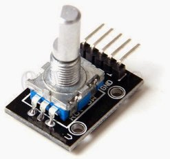
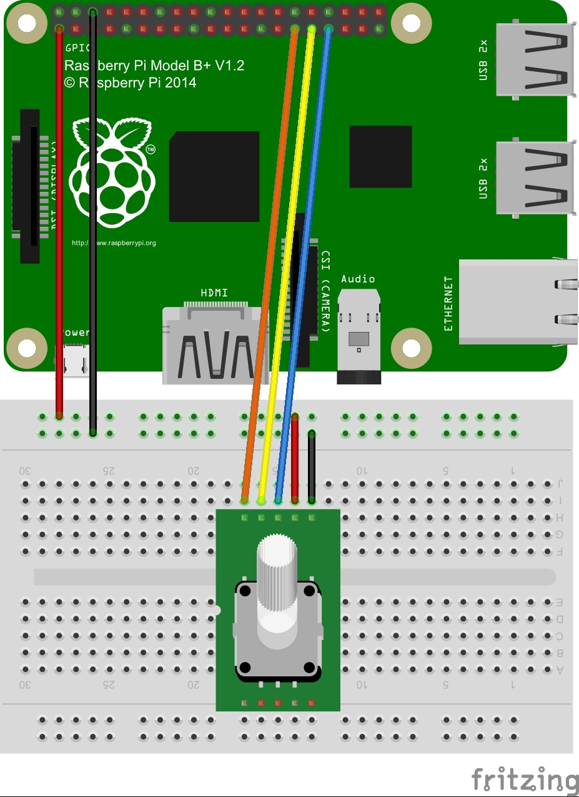

**This repository and project has now been archived and is no longer supported. The code will remain available for reference and information.**

# KY040 Python Module

> Martin O'Hanlon (martin@ohanlonweb.com)
>
> http://www.stuffaboutcode.com

A python module for reading the values from a KY040 rotary encoder module using a Raspberry Pi.

http://www.stuffaboutcode.com/2015/05/raspberry-pi-and-ky040-rotary-encoder.html



## Usage

Listen for rotary change and switch button press:

``` python
# Define your pins
CLOCKPIN = 5
DATAPIN = 6
SWITCHPIN = 13

# Callback for rotary change
def rotaryChange(direction):
    print "turned - " + str(direction)

# Callback for switch button pressed
def switchPressed():
    print "button pressed"

# Create a KY040 and start it
ky040 = KY040(CLOCKPIN, DATAPIN, SWITCHPIN, rotaryChange, switchPressed)
ky040.start()

# Keep your proccess running
try:
    while True:
        sleep(0.1)
finally:
    ky040.stop()
    GPIO.cleanup()
```

If you're not using switch button, only listen for rotary change:

``` python
# Define your rotary pins
CLOCKPIN = 5
DATAPIN = 6

# Callback for rotary change
def rotaryChange(direction):
    print "turned - " + str(direction)

# Create a KY040 and start it
ky040 = KY040(CLOCKPIN, DATAPIN, rotaryCallback=rotaryChange)
ky040.start()

# Keep your proccess running
try:
    while True:
        sleep(0.1)
finally:
    ky040.stop()
    GPIO.cleanup()
```

Using a custom bounce time:

``` python
# Create a KY040 and start it
ky040 = KY040(CLOCKPIN, DATAPIN, SWITCHPIN, rotaryChange, switchPressed, rotaryBouncetime=40, switchBouncetime=40)
ky040.start()
```


## Wiring




## Version history
* 0.1 - Initial stable version
* 0.2 - Minor improvement

## License

This project is under [MIT](LICENSE) License.
